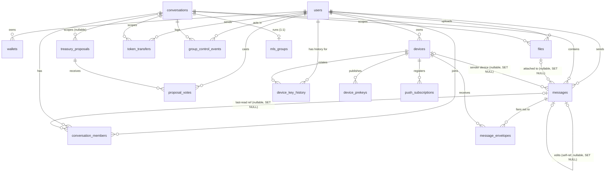
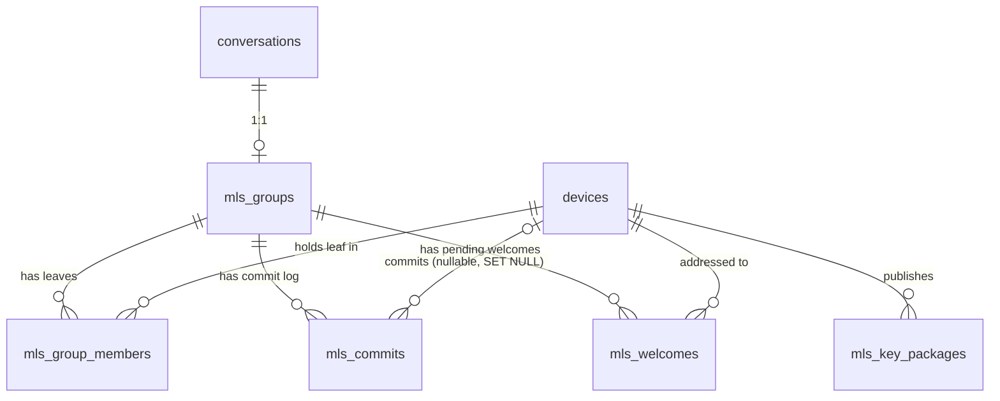

# Database schema reference

Every table, column, index, check constraint, and relation defined in
[`db/schema.ts`](../src/db/schema.ts), the single source of truth for the
backend's Postgres schema (Drizzle ORM). Generated directly from the current
`schema.ts`; if you suspect it has drifted from the applied database, diff it
against a fresh `pnpm db:generate` output (see
[`migrations.md`](migrations.md) for that workflow) — this document does not
read `drizzle/` migration files directly.

## Table of contents

- [Enums](#enums)
- [Entity-relationship diagram](#entity-relationship-diagram)
- [Core identity & messaging](#core-identity--messaging)
  - [`users`](#users)
  - [`wallets`](#wallets)
  - [`conversations`](#conversations)
  - [`conversation_members`](#conversation_members)
  - [`files`](#files)
  - [`messages`](#messages)
  - [`message_envelopes`](#message_envelopes)
- [Devices & E2EE key material](#devices--e2ee-key-material)
  - [`devices`](#devices)
  - [`device_prekeys`](#device_prekeys)
  - [`device_key_history`](#device_key_history)
- [MLS group state](#mls-group-state)
  - [`mls_groups`](#mls_groups)
  - [`mls_group_members`](#mls_group_members)
  - [`mls_commits`](#mls_commits)
  - [`mls_welcomes`](#mls_welcomes)
  - [`mls_key_packages`](#mls_key_packages)
- [Chain-synced data](#chain-synced-data)
  - [`token_transfers`](#token_transfers)
  - [`treasury_proposals`](#treasury_proposals)
  - [`proposal_votes`](#proposal_votes)
- [Push & audit](#push--audit)
  - [`push_subscriptions`](#push_subscriptions)
  - [`audit_logs`](#audit_logs)
  - [`group_control_events`](#group_control_events)
- [Drizzle `relations()` vs. actual foreign keys](#drizzle-relations-vs-actual-foreign-keys)
- [Notable schema observations](#notable-schema-observations)

## Enums

Every `pgEnum` defined in `schema.ts`, in declaration order:

| Enum (Postgres type name) | Values | Used by |
|---|---|---|
| `conversation_type` | `dm`, `group` | `conversations.type` |
| `content_type` | `text`, `file`, `image`, `video`, `audio`, `system` | **Not currently applied to any column** — see [Notable schema observations](#notable-schema-observations) |
| `file_status` | `pending`, `ready`, `deleted` | `files.status` |
| `e2ee_protocol` | `sealed_box`, `signal`, `mls` | `message_envelopes.protocol` |
| `device_platform` | `web`, `ios`, `android` | `devices.platform` |
| `prekey_type` | `signed`, `one_time` | `device_prekeys.key_type` |
| `treasury_proposal_status` | `active`, `approved`, `rejected`, `executed`, `expired` | `treasury_proposals.status` |
| `proposal_vote_type` | `approve`, `reject` | `proposal_votes.vote` |
| `audit_action` | `device_linked`, `device_revoked`, `logout_everywhere`, `key_bundle_drained`, `auth_failed`, `file_access_denied`, `group_member_added`, `group_member_removed` | `audit_logs.action` |
| `group_control_event_type` | `member_added`, `member_removed`, `member_left`, `commit` | `group_control_events.event_type` |

## Entity-relationship diagram

Cardinalities reflect the actual `.references()` foreign keys in `schema.ts`
(not the separate `relations()` blocks — see
[below](#drizzle-relations-vs-actual-foreign-keys)). Split into two diagrams
for legibility; `devices` and `conversations` are the shared anchors between
them.

**Core identity, messaging, devices, and chain-synced data:**

**MLS group state** (all keyed through `mls_groups`, one row per
`conversations` row running MLS):

---

## Core identity & messaging

### `users`

| Column | DB name | Type | Nullable | Default | Notes |
|---|---|---|---|---|---|
| `id` | `id` | `uuid` | no | `gen_random_uuid()` | Primary key. |
| `username` | `username` | `text` | yes | — | Unique. |
| `avatarUrl` | `avatar_url` | `text` | yes | — | |
| `presenceVisible` | `presence_visible` | `boolean` | no | `false` | Gates presence broadcast — see [`concepts-presence-heartbeat.md`](concepts-presence-heartbeat.md#privacy-gating). |
| `lastSeenVisible` | `last_seen_visible` | `boolean` | no | `false` | Gates whether a `lastSeen` timestamp is ever disclosed. |
| `createdAt` | `created_at` | `timestamp` | no | `now()` | |
| `updatedAt` | `updated_at` | `timestamp` | no | `now()` | Not auto-updated by a DB trigger — the application must set it explicitly on update. |
| `sendReadReceipts` | `send_read_receipts` | `boolean` | no | `false` | Privacy setting: whether this user sends read receipts to others. |
| `allowDirectMessages` | `allow_direct_messages` | `boolean` | no | `true` | |
| `allowGroupInvites` | `allow_group_invites` | `boolean` | no | `false` | |

**Indexes/constraints:** primary key on `id`; unique constraint on `username`
(no named index given — Drizzle's `.unique()` shorthand). No composite or
partial indexes.

**Relations:** referenced by `wallets`, `conversation_members`, `devices`,
`messages.senderId`, `files.uploaderId`, `token_transfers.senderId`,
`proposal_votes`, `device_key_history`, `group_control_events`
(`actorUserId`/`targetUserId`) — all `ON DELETE CASCADE` except
`group_control_events`, which uses `ON DELETE SET NULL` for both user
references (see that table below).

---

### `wallets`

| Column | DB name | Type | Nullable | Default | Notes |
|---|---|---|---|---|---|
| `id` | `id` | `uuid` | no | `gen_random_uuid()` | PK. |
| `userId` | `user_id` | `uuid` | no | — | FK → `users.id`, `ON DELETE CASCADE`. |
| `address` | `address` | `text` | no | — | Unique. Stellar wallet address. |
| `isPrimary` | `is_primary` | `boolean` | no | `false` | No DB-level constraint enforcing at most one primary wallet per user — enforced by application logic only (see `resolveAccountWallet` in `routes/devices.ts`, which falls back to the first row if none is flagged primary). |
| `createdAt` | `created_at` | `timestamp` | no | `now()` | |

**Indexes/constraints:** PK on `id`; unique constraint on `address`.

---

### `conversations`

| Column | DB name | Type | Nullable | Default | Notes |
|---|---|---|---|---|---|
| `id` | `id` | `uuid` | no | `gen_random_uuid()` | PK. |
| `type` | `type` | `conversation_type` enum | no | `'dm'` | `dm` or `group`. |
| `name` | `name` | `text` | yes | — | |
| `avatarUrl` | `avatar_url` | `text` | yes | — | |
| `epoch` | `epoch` | `integer` | no | `0` | Incremented by every group-control event; this row also serializes event ordering, so a concurrent join and leave can never receive the same sequence number — see `group_control_events` below. |
| `createdAt` | `created_at` | `timestamp` | no | `now()` | |

**Indexes/constraints:** PK on `id`. No other indexes or constraints.

**Relations:** referenced (all `ON DELETE CASCADE` unless noted) by
`conversation_members`, `messages`, `files`, `token_transfers`,
`treasury_proposals` (`ON DELETE SET NULL`), `mls_groups` (unique — one MLS
group per conversation), `group_control_events`.

---

### `conversation_members`

| Column | DB name | Type | Nullable | Default | Notes |
|---|---|---|---|---|---|
| `id` | `id` | `uuid` | no | `gen_random_uuid()` | PK. |
| `conversationId` | `conversation_id` | `uuid` | no | — | FK → `conversations.id`, `ON DELETE CASCADE`. |
| `userId` | `user_id` | `uuid` | no | — | FK → `users.id`, `ON DELETE CASCADE`. |
| `lastReadMessageId` | `last_read_message_id` | `uuid` | yes | — | FK → `messages.id`, `ON DELETE SET NULL`. |
| `isMuted` | `is_muted` | `boolean` | no | `false` | |
| `isArchived` | `is_archived` | `boolean` | no | `false` | |
| `joinedAt` | `joined_at` | `timestamp` | no | `now()` | |

**Indexes/constraints:** PK on `id` only. **No index at all on
`(conversationId, userId)` or `conversationId` alone** — see
[Notable schema observations](#notable-schema-observations) for what this
means in practice.

---

### `files`

| Column | DB name | Type | Nullable | Default | Notes |
|---|---|---|---|---|---|
| `id` | `id` | `uuid` | no | `gen_random_uuid()` | PK. |
| `uploaderId` | `uploader_id` | `uuid` | no | — | FK → `users.id`, `ON DELETE CASCADE`. |
| `conversationId` | `conversation_id` | `uuid` | no | — | FK → `conversations.id`, `ON DELETE CASCADE`. |
| `status` | `status` | `file_status` enum | no | `'pending'` | `pending` → `ready` → `deleted` lifecycle. |
| `size` | `size` | `integer` | no | — | |
| `mimeType` | `mime_type` | `text` | no | — | |
| `sha256` | `sha256` | `text` | no | — | Not unique — two uploads of identical bytes get two rows and two storage objects. |
| `storageKey` | `storage_key` | `text` | no | — | Unique. Object-store key. |
| `isThumbnail` | `is_thumbnail` | `boolean` | no | `false` | |
| `deletedAt` | `deleted_at` | `timestamp` | yes | — | Set when every referencing message is retracted (soft delete). |
| `hardDeletedAt` | `hard_deleted_at` | `timestamp` | yes | — | Set once the object-store object is actually deleted — see [`concepts-gc-jobs.md`](concepts-gc-jobs.md#file-cleanup--servicesfilecleanupts). |
| `createdAt` | `created_at` | `timestamp` | no | `now()` | |

**Indexes/constraints:** PK on `id`; unique constraint on `storageKey`. Only
the `fileId` column *on `messages`* (not here) indexes the relationship back
to a file — there is no index on `files.conversationId` or
`files.uploaderId`.

The `fileKey` (symmetric encryption key for the file's contents) is
deliberately **never** stored in this table or anywhere server-side — it
lives only inside the E2EE envelope ciphertext. See
[`concepts-e2ee-key-management.md`](concepts-e2ee-key-management.md#what-the-server-can-and-cannot-see).

---

### `messages`

Ordering is by `(createdAt, id)` — `id` (a `uuid`) is only a tiebreaker for
same-millisecond inserts, not a chronological signal. The source comment
notes a monotonic per-conversation sequence counter was considered (and
briefly implemented) but dropped, since the same counter couldn't coherently
serve both per-conversation ordering and the cross-conversation offline-sync
cursor (`/sync`).

| Column | DB name | Type | Nullable | Default | Notes |
|---|---|---|---|---|---|
| `id` | `id` | `uuid` | no | `gen_random_uuid()` | PK. |
| `conversationId` | `conversation_id` | `uuid` | no | — | FK → `conversations.id`, `ON DELETE CASCADE`. |
| `senderId` | `sender_id` | `uuid` | no | — | FK → `users.id`, `ON DELETE CASCADE`. |
| `senderDeviceId` | `sender_device_id` | `uuid` | yes | — | FK → `devices.id`, `ON DELETE SET NULL`. |
| `contentType` | `content_type` | **plain `text`** | no | `'text'` | **Not** typed as the `content_type` enum despite that enum existing — see [Notable schema observations](#notable-schema-observations). Values used in practice: `text`, `file`, `image`, `video`, `audio`, `system`. |
| `ciphertext` | `ciphertext` | `text` | yes | — | Opaque E2EE ciphertext; `NULL` for `system` rows (enforced by the check constraint below). |
| `systemPayload` | `system_payload` | `jsonb` | yes | — | Typed as `{ userId: string; change: string } \| null`. Structured, server-generated metadata for `content_type = 'system'` rows only. |
| `fileId` | `file_id` | `uuid` | yes | — | FK → `files.id`, `ON DELETE SET NULL`. |
| `editsMessageId` | `edits_message_id` | `uuid` | yes | — | Self-referencing FK → `messages.id`, `ON DELETE SET NULL`. |
| `mlsEpoch` | `mls_epoch` | `bigint` (number mode) | yes | — | MLS epoch whose secrets encrypted `ciphertext`; `NULL` for non-MLS-group messages. |
| `createdAt` | `created_at` | `timestamp` | no | `now()` | |
| `deletedAt` | `deleted_at` | `timestamp` | yes | — | Retraction marker. |

**Indexes:**

| Name | Columns | Notes |
|---|---|---|
| `messages_conversation_created_idx` | `(conversation_id, created_at)` | The primary read-path index — paginated history per conversation. |

**Check constraints:**

| Name | Expression | Enforces |
|---|---|---|
| `messages_system_payload_check` | `content_type <> 'system' OR (ciphertext IS NULL AND system_payload IS NOT NULL)` | A `system` row always carries structured metadata and never ciphertext; every other row never carries a system payload. The source comment notes this **supersedes** an earlier, looser constraint (`messages_system_payload_only_on_system_type`) that only forbade a payload on non-system rows without requiring a system row to actually have one. |

---

### `message_envelopes`

One row per **(message, recipient device)** — the actual per-device delivery
unit.

| Column | DB name | Type | Nullable | Default | Notes |
|---|---|---|---|---|---|
| `id` | `id` | `uuid` | no | `gen_random_uuid()` | PK. |
| `messageId` | `message_id` | `uuid` | no | — | FK → `messages.id`, `ON DELETE CASCADE`. |
| `recipientDeviceId` | `recipient_device_id` | `uuid` | no | — | FK → `devices.id`, `ON DELETE CASCADE`. |
| `recipientUserId` | `recipient_user_id` | `uuid` | no | — | FK → `users.id`, `ON DELETE CASCADE`. |
| `ciphertext` | `ciphertext` | `text` | no | — | Per-device-encrypted ciphertext — opaque to the server. |
| `protocol` | `protocol` | `e2ee_protocol` enum | no | `'sealed_box'` | Which construction produced this envelope's ciphertext. Defaults to `sealed_box` so every pre-existing row is correctly labelled by the migration's backfill. Recorded per envelope (not derived from the device's current capabilities) because a device's capability set changes over time but an envelope written months ago must still decrypt on whatever path it was actually encrypted with. |
| `deliveredAt` | `delivered_at` | `timestamp` | yes | — | |
| `readAt` | `read_at` | `timestamp` | yes | — | |
| `createdAt` | `created_at` | `timestamp` | no | `now()` | |

**Indexes:**

| Name | Columns | Notes |
|---|---|---|
| `me_recipient_device_created_idx` | `(recipient_device_id, created_at)` | Per-device delivery/sync queries. |
| `me_message_idx` | `(message_id)` | Fan-out lookups by message. |

This table is the target of the tightest-retention background job in the
system — see
[`concepts-gc-jobs.md`](concepts-gc-jobs.md#envelope-gc--servicesenvelopegcts).

---

## Devices & E2EE key material

### `devices`

The single canonical device registry — see
[`concepts-e2ee-key-management.md`](concepts-e2ee-key-management.md) for the
full lifecycle this table models.

| Column | DB name | Type | Nullable | Default | Notes |
|---|---|---|---|---|---|
| `id` | `id` | `uuid` | no | `gen_random_uuid()` | PK. |
| `userId` | `user_id` | `uuid` | no | — | FK → `users.id`, `ON DELETE CASCADE`. |
| `identityPublicKey` | `identity_public_key` | `text` | no | — | Base64 Ed25519 public key. Immutable per row — see [`concepts-e2ee-key-management.md`](concepts-e2ee-key-management.md#7-key-rotation-and-the-unwritten-devicekeyhistory-table). |
| `registrationId` | `registration_id` | `integer` | yes | — | X3DH/Signal registration id. |
| `deviceName` | `device_name` | `text` | yes | — | |
| `platform` | `platform` | `device_platform` enum | yes | — | `web`, `ios`, or `android`. |
| `lastSeenAt` | `last_seen_at` | `timestamp` | yes | — | Updated on auth, connect, heartbeat, and disconnect — see [`concepts-presence-heartbeat.md`](concepts-presence-heartbeat.md). |
| `pushEnabled` | `push_enabled` | `boolean` | no | `true` | |
| `revokedAt` | `revoked_at` | `timestamp` | yes | — | `NULL` while active. Row is never deleted on revocation — preserves audit history. |
| `staleFlaggedAt` | `stale_flagged_at` | `timestamp` | yes | — | Set by the device-GC job once revoked past the retention window; informational only. |
| `capabilities` | `capabilities` | `jsonb` | no | `DEFAULT_CAPABILITIES` | Typed as `DeviceCapabilities`; defaults to the sealed-box-only baseline so pre-existing rows (or clients that omit it) negotiate correctly — see [`concepts-protocol-negotiation.md`](concepts-protocol-negotiation.md). |
| `createdAt` | `created_at` | `timestamp` | no | `now()` | |
| `updatedAt` | `updated_at` | `timestamp` | no | `now()` | |

**Indexes:**

| Name | Columns | Type | Enforces |
|---|---|---|---|
| `devices_user_identity_idx` | `(user_id, identity_public_key)` | unique | At most one device row per `(user, identity key)` pair — the lookup key both device-creation paths (`POST /auth/verify`, `POST /devices/link/verify`) key off of. |
| `devices_user_id_active_idx` | `(user_id)` **WHERE `revoked_at IS NULL`** | partial, non-unique | Fast "this user's active devices" scans without touching revoked history. |

---

### `device_prekeys`

Signed and one-time prekeys in a single table, discriminated by `key_type`.

| Column | DB name | Type | Nullable | Default | Notes |
|---|---|---|---|---|---|
| `id` | `id` | `uuid` | no | `gen_random_uuid()` | PK. |
| `deviceId` | `device_id` | `uuid` | no | — | FK → `devices.id`, `ON DELETE CASCADE`. |
| `keyType` | `key_type` | `prekey_type` enum | no | — | `signed` or `one_time`. |
| `keyId` | `key_id` | `integer` | no | — | Application-assigned, unique per `(device, type)`. |
| `publicKey` | `public_key` | `text` | no | — | Base64 public key. |
| `signature` | `signature` | `text` | yes | — | Base64 Ed25519 signature over `publicKey`, signed by the device's `identityPublicKey`. Required when `keyType = 'signed'` (enforced below). |
| `consumed` | `consumed` | `boolean` | no | `false` | One-time keys only in practice; flips to `true` on bundle-fetch claim rather than deleting the row, so fetch history stays auditable. |
| `createdAt` | `created_at` | `timestamp` | no | `now()` | |

**Indexes:**

| Name | Columns | Type | Enforces |
|---|---|---|---|
| `device_prekeys_device_type_keyid_idx` | `(device_id, key_type, key_id)` | unique | No duplicate `keyId` within the same device + key type; also the `ON CONFLICT DO NOTHING` target for idempotent one-time-prekey re-uploads. |
| `device_prekeys_signed_device_idx` | `(device_id)` **WHERE `key_type = 'signed'`** | partial unique | At most one active signed prekey per device — the `ON CONFLICT` target the upload route upserts against. |
| `device_prekeys_one_time_available_idx` | `(device_id)` **WHERE `key_type = 'one_time' AND consumed = false`** | partial, non-unique | Fast bundle-assembly lookup of a device's unconsumed one-time pool. |

**Check constraints:**

| Name | Expression | Enforces |
|---|---|---|
| `device_prekeys_signed_requires_signature` | `key_type <> 'signed' OR signature IS NOT NULL` | A signed prekey row must carry a signature; one-time rows are unconstrained on this column. |

---

### `device_key_history`

Append-only log of identity-key changes per device — intended to let clients
detect silent key swaps. **Verified: no code path in `apps/backend/src`
currently writes to this table** — see
[`concepts-e2ee-key-management.md`](concepts-e2ee-key-management.md#7-key-rotation-and-the-unwritten-devicekeyhistory-table)
for the full explanation. Only `GET /users/:id/key-history` reads it.

| Column | DB name | Type | Nullable | Default | Notes |
|---|---|---|---|---|---|
| `id` | `id` | `uuid` | no | `gen_random_uuid()` | PK. |
| `deviceId` | `device_id` | `uuid` | no | — | FK → `devices.id`, `ON DELETE CASCADE`. |
| `userId` | `user_id` | `uuid` | no | — | FK → `users.id`, `ON DELETE CASCADE`. |
| `previousKey` | `previous_key` | `text` | yes | — | |
| `newKey` | `new_key` | `text` | no | — | |
| `changeReason` | `change_reason` | `text` | yes | — | |
| `recordedAt` | `recorded_at` | `timestamp` | no | `now()` | |

**Indexes:**

| Name | Columns |
|---|---|
| `device_key_history_device_idx` | `(device_id, recorded_at)` |
| `device_key_history_user_idx` | `(user_id, recorded_at)` |

---

## MLS group state

Group conversations run MLS (RFC 9420). The server is a transport and
ordering service — it never holds group secrets, only the public ledger
every member needs to agree on. See
[`mls-group-membership.md`](mls-group-membership.md) and
[`mls-key-packages.md`](mls-key-packages.md) for the protocol-level detail
this section's tables support.

### `mls_groups`

| Column | DB name | Type | Nullable | Default | Notes |
|---|---|---|---|---|---|
| `id` | `id` | `uuid` | no | `gen_random_uuid()` | PK. |
| `conversationId` | `conversation_id` | `uuid` | no | — | FK → `conversations.id`, `ON DELETE CASCADE`. |
| `groupId` | `group_id` | `text` | no | — | Base64 of the MLS group id chosen by the founding client. |
| `cipherSuite` | `cipher_suite` | `integer` | no | — | |
| `currentEpoch` | `current_epoch` | `bigint` (number mode) | no | `0` | Epoch of the most recent accepted commit. |
| `createdAt` | `created_at` | `timestamp` | no | `now()` | |
| `updatedAt` | `updated_at` | `timestamp` | no | `now()` | |

**Indexes:**

| Name | Columns | Type | Enforces |
|---|---|---|---|
| `mls_groups_conversation_idx` | `(conversation_id)` | unique | One MLS group per conversation — the conversation *is* the group. |
| `mls_groups_group_id_idx` | `(group_id)` | unique | |

---

### `mls_group_members`

Device membership recorded as an **epoch interval**, not a boolean, so a
device's decryption window is derivable: it can read epochs in
`[joinedAtEpoch, removedAtEpoch)`.

| Column | DB name | Type | Nullable | Default | Notes |
|---|---|---|---|---|---|
| `id` | `id` | `uuid` | no | `gen_random_uuid()` | PK. |
| `mlsGroupId` | `mls_group_id` | `uuid` | no | — | FK → `mls_groups.id`, `ON DELETE CASCADE`. |
| `deviceId` | `device_id` | `uuid` | no | — | FK → `devices.id`, `ON DELETE CASCADE`. |
| `userId` | `user_id` | `uuid` | no | — | FK → `users.id`, `ON DELETE CASCADE`. |
| `joinedAtEpoch` | `joined_at_epoch` | `bigint` (number mode) | no | — | |
| `removedAtEpoch` | `removed_at_epoch` | `bigint` (number mode) | yes | — | `NULL` while the device is still in the group. |
| `createdAt` | `created_at` | `timestamp` | no | `now()` | |

**Indexes:**

| Name | Columns | Type | Enforces |
|---|---|---|---|
| `mls_group_members_active_idx` | `(mls_group_id, device_id)` **WHERE `removed_at_epoch IS NULL`** | partial unique | A device can hold at most one *active* leaf in a group at a time. A device removed and later re-added gets a **second row** with a later `joinedAtEpoch` rather than reusing the first — this partial unique index is what makes that legal (the old row's `removedAtEpoch` is non-null, so it no longer competes for uniqueness). |
| `mls_group_members_device_idx` | `(device_id)` | non-unique | Cross-group lookups by device. |

---

### `mls_commits`

Append-only commit log. A device that was offline replays from its last
known epoch to catch up.

| Column | DB name | Type | Nullable | Default | Notes |
|---|---|---|---|---|---|
| `id` | `id` | `uuid` | no | `gen_random_uuid()` | PK. |
| `mlsGroupId` | `mls_group_id` | `uuid` | no | — | FK → `mls_groups.id`, `ON DELETE CASCADE`. |
| `epoch` | `epoch` | `bigint` (number mode) | no | — | The epoch this commit *produces*. |
| `committerDeviceId` | `committer_device_id` | `uuid` | yes | — | FK → `devices.id`, `ON DELETE SET NULL`. |
| `commit` | `commit` | `text` | no | — | Base64 of the TLS-serialised MLS `Commit` message. |
| `createdAt` | `created_at` | `timestamp` | no | `now()` | |

**Indexes:**

| Name | Columns | Type | Enforces |
|---|---|---|---|
| `mls_commits_group_epoch_idx` | `(mls_group_id, epoch)` | unique | Two members committing concurrently cannot both win — the epoch race resolves in the database via this constraint. |

---

### `mls_welcomes`

Welcome messages addressed to a device being added, held until it comes
online and claims them.

| Column | DB name | Type | Nullable | Default | Notes |
|---|---|---|---|---|---|
| `id` | `id` | `uuid` | no | `gen_random_uuid()` | PK. |
| `mlsGroupId` | `mls_group_id` | `uuid` | no | — | FK → `mls_groups.id`, `ON DELETE CASCADE`. |
| `deviceId` | `device_id` | `uuid` | no | — | FK → `devices.id`, `ON DELETE CASCADE`. |
| `epoch` | `epoch` | `bigint` (number mode) | no | — | The epoch the recipient joins at. |
| `welcome` | `welcome` | `text` | no | — | Base64 of the TLS-serialised MLS `Welcome` message. |
| `claimedAt` | `claimed_at` | `timestamp` | yes | — | `NULL` while pending. |
| `createdAt` | `created_at` | `timestamp` | no | `now()` | |

**Indexes:**

| Name | Columns | Type | Enforces |
|---|---|---|---|
| `mls_welcomes_group_device_epoch_idx` | `(mls_group_id, device_id, epoch)` | unique | |
| `mls_welcomes_pending_idx` | `(device_id)` **WHERE `claimed_at IS NULL`** | partial, non-unique | Fast "what's waiting for this device" lookup on reconnect. |

---

### `mls_key_packages`

Each device publishes a stock of MLS KeyPackages so any group member can add
it without the device being online. Public key material only.

| Column | DB name | Type | Nullable | Default | Notes |
|---|---|---|---|---|---|
| `id` | `id` | `uuid` | no | `gen_random_uuid()` | PK. |
| `deviceId` | `device_id` | `uuid` | no | — | FK → `devices.id`, `ON DELETE CASCADE`. |
| `cipherSuite` | `cipher_suite` | `integer` | no | — | IANA MLS cipher suite id; a device may publish packages for several suites. |
| `keyPackage` | `key_package` | `text` | no | — | Base64 of the TLS-serialised MLS `KeyPackage`. Up to ~4 KiB. |
| `packageHash` | `package_hash` | `text` | no | — | SHA-256 (hex) of `keyPackage` — exists specifically because the package itself is too large for a btree unique index, but idempotent re-uploads still need a conflict target. |
| `expiresAt` | `expires_at` | `timestamp` | yes | — | |
| `consumed` | `consumed` | `boolean` | no | `false` | Single-use by spec — flips to `true` inside the same transaction that hands the package out (never deleted, preserving audit history), mirroring `device_prekeys.consumed`. |
| `consumedAt` | `consumed_at` | `timestamp` | yes | — | |
| `createdAt` | `created_at` | `timestamp` | no | `now()` | |

**Indexes:**

| Name | Columns | Type | Enforces |
|---|---|---|---|
| `mls_key_packages_device_hash_idx` | `(device_id, package_hash)` | unique | Dedupe target for idempotent re-uploads. |
| `mls_key_packages_available_idx` | `(device_id, cipher_suite, created_at)` **WHERE `consumed = false`** | partial, non-unique | Fast claim of the next available package for a device + cipher suite. |

---

## Chain-synced data

### `token_transfers`

One row per Soroban `transfer` event the listener
(`services/stellarListener.ts`) pulls off the chain.

| Column | DB name | Type | Nullable | Default | Notes |
|---|---|---|---|---|---|
| `id` | `id` | `uuid` | no | `gen_random_uuid()` | PK. |
| `conversationId` | `conversation_id` | `uuid` | no | — | FK → `conversations.id`, `ON DELETE CASCADE`. |
| `senderId` | `sender_id` | `uuid` | no | — | FK → `users.id`, `ON DELETE CASCADE`. |
| `recipientAddress` | `recipient_address` | `text` | no | — | Raw Stellar address — not a FK to `wallets`, since the recipient need not be a Clicked user. |
| `amount` | `amount` | `text` | no | — | Stored as text, not a numeric type — avoids floating-point/precision loss for on-chain integer amounts. |
| `tokenContractId` | `token_contract_id` | `text` | no | — | |
| `txHash` | `tx_hash` | `text` | no | — | Unique — the upsert target that makes reconnects and replayed event pages idempotent. |
| `memo` | `memo` | `text` | yes | — | Correlates an on-chain transfer with a chat message. |
| `createdAt` | `created_at` | `timestamp` | no | `now()` | |

**Indexes/constraints:** PK on `id`; unique constraint on `txHash`.

---

### `treasury_proposals`

Synced from `GROUP_TREASURY_CONTRACT_ID` events by the Stellar listener.
Idempotent upsert on `(contractId, proposalId)`.

| Column | DB name | Type | Nullable | Default | Notes |
|---|---|---|---|---|---|
| `id` | `id` | `uuid` | no | `gen_random_uuid()` | PK. |
| `contractId` | `contract_id` | `text` | no | — | The on-chain `group_treasury` contract address. |
| `proposalId` | `proposal_id` | `text` | no | — | The on-chain proposal id (`u32`, stored as text). |
| `conversationId` | `conversation_id` | `uuid` | yes | — | FK → `conversations.id`, `ON DELETE SET NULL`. |
| `status` | `status` | `treasury_proposal_status` enum | no | `'active'` | Mirrors the on-chain `ProposalStatus` — see [`../../../contracts/docs/contracts-group-treasury-storage.md`](../../../contracts/docs/contracts-group-treasury-storage.md) for the contract-side state machine this tracks. |
| `approvalsCount` | `approvals_count` | `integer` | no | `0` | |
| `rejectionsCount` | `rejections_count` | `integer` | no | `0` | |
| `recipient` | `recipient` | `text` | yes | — | |
| `amount` | `amount` | `text` | yes | — | Text, same precision rationale as `token_transfers.amount`. |
| `token` | `token` | `text` | yes | — | |
| `threshold` | `threshold` | `integer` | no | `3` | Mirrors the on-chain threshold at sync time — a default used only until the real event arrives. |
| `createdAt` | `created_at` | `timestamp` | no | `now()` | |
| `updatedAt` | `updated_at` | `timestamp` | no | `now()` | |

**Indexes:**

| Name | Columns | Type | Enforces |
|---|---|---|---|
| `treasury_proposals_contract_proposal_idx` | `(contract_id, proposal_id)` | unique | The upsert target for idempotent chain-event syncing. |

---

### `proposal_votes`

| Column | DB name | Type | Nullable | Default | Notes |
|---|---|---|---|---|---|
| `id` | `id` | `uuid` | no | `gen_random_uuid()` | PK. |
| `treasuryProposalId` | `treasury_proposal_id` | `uuid` | no | — | FK → `treasury_proposals.id`, `ON DELETE CASCADE`. |
| `userId` | `user_id` | `uuid` | no | — | FK → `users.id`, `ON DELETE CASCADE`. |
| `vote` | `vote` | `proposal_vote_type` enum | no | — | `approve` or `reject`. |
| `signature` | `signature` | `text` | yes | — | |
| `createdAt` | `created_at` | `timestamp` | no | `now()` | |

**Indexes:**

| Name | Columns | Type | Enforces |
|---|---|---|---|
| `proposal_votes_proposal_user_unique` | `(treasury_proposal_id, user_id)` | unique | One recorded vote per user per proposal. |

---

## Push & audit

### `push_subscriptions`

| Column | DB name | Type | Nullable | Default | Notes |
|---|---|---|---|---|---|
| `id` | `id` | `uuid` | no | `gen_random_uuid()` | PK. |
| `deviceId` | `device_id` | `uuid` | no | — | FK → `devices.id`, `ON DELETE CASCADE`. |
| `endpoint` | `endpoint` | `text` | no | — | Unique. The Web Push endpoint URL. |
| `p256dh` | `p256dh` | `text` | no | — | Web Push encryption key. |
| `auth` | `auth` | `text` | no | — | Web Push auth secret. |
| `lastUsedAt` | `last_used_at` | `timestamp` | yes | — | |
| `disabledAt` | `disabled_at` | `timestamp` | yes | — | Backoff marker set on a transient send failure; cleared by the re-enable pass once the backoff window elapses — see [`concepts-gc-jobs.md`](concepts-gc-jobs.md#push-subscription-backoff-re-enable). |
| `createdAt` | `created_at` | `timestamp` | no | `now()` | |

**Indexes/constraints:** PK on `id`; unique constraint on `endpoint`.

---

### `audit_logs`

Append-only record of security-relevant events. Nothing here may contain
message content — rows carry identifiers, counts, and outcomes only; the
writing service (`services/auditLog.ts`) strips anything content-shaped
before it reaches the database.

| Column | DB name | Type | Nullable | Default | Notes |
|---|---|---|---|---|---|
| `id` | `id` | `uuid` | no | `gen_random_uuid()` | PK. |
| `action` | `action` | `audit_action` enum | no | — | |
| `actorUserId` | `actor_user_id` | `uuid` | yes | — | **Not a foreign key** (deliberately — see below). |
| `actorDeviceId` | `actor_device_id` | `uuid` | yes | — | Not a foreign key. |
| `subjectUserId` | `subject_user_id` | `uuid` | yes | — | Not a foreign key. Nullable because a failed sign-in has no established actor. |
| `targetType` | `target_type` | `text` | yes | — | Free text: `'device'`, `'file'`, `'conversation'`, `'wallet'`, etc. |
| `targetId` | `target_id` | `text` | yes | — | |
| `ipAddress` | `ip_address` | `text` | yes | — | |
| `userAgent` | `user_agent` | `text` | yes | — | |
| `metadata` | `metadata` | `jsonb` | yes | — | Typed as `Record<string, unknown>`; sanitised, bounded key/value context — never message content. |
| `createdAt` | `created_at` | `timestamp` | no | `now()` | |

**Why the actor/subject columns are plain `uuid`, not foreign keys:** an
audit row must record what was true when it was written and stay that way.
A `CASCADE` FK would delete audit history along with the account it
incriminates; `ON DELETE SET NULL` would issue an `UPDATE` that the
append-only trigger (next paragraph) correctly refuses. A responder resolves
these ids (or finds them already gone) at read time instead.

**Indexes:**

| Name | Columns | Notes |
|---|---|---|
| `audit_logs_subject_created_idx` | `(subject_user_id, created_at)` | Primary read path: "what happened *to* this account." |
| `audit_logs_actor_created_idx` | `(actor_user_id, created_at)` | "What did this account/device *do*." |
| `audit_logs_action_created_idx` | `(action, created_at)` | "Every failed auth in the last hour," incident-response style queries. |

**Append-only enforcement is not visible in `schema.ts` at all** — it's a
database-level trigger (`audit_logs_no_mutation`, referenced by the schema
comment as living in the corresponding migration) that rejects `UPDATE`s and
`DELETE`s against this table outright, specifically so the log's integrity
does not depend on the same application credentials an attacker would
already have reached. See
[`../../../docs/security/audit-logging.md`](../../../docs/security/audit-logging.md).

---

### `group_control_events`

| Column | DB name | Type | Nullable | Default | Notes |
|---|---|---|---|---|---|
| `id` | `id` | `uuid` | no | `gen_random_uuid()` | PK. |
| `conversationId` | `conversation_id` | `uuid` | no | — | FK → `conversations.id`, `ON DELETE CASCADE`. |
| `sequence` | `sequence` | `integer` | no | — | Strictly increasing from 1, gap-free within a conversation. |
| `epoch` | `epoch` | `integer` | no | — | Group epoch after this event was applied — mirrors `conversations.epoch` at the time of writing. |
| `eventType` | `event_type` | `group_control_event_type` enum | no | — | |
| `actorUserId` | `actor_user_id` | `uuid` | yes | — | FK → `users.id`, `ON DELETE SET NULL`. |
| `targetUserId` | `target_user_id` | `uuid` | yes | — | FK → `users.id`, `ON DELETE SET NULL`. |
| `messageId` | `message_id` | `uuid` | yes | — | FK → `messages.id`, `ON DELETE SET NULL`. The system message emitted for this event, when one was created. |
| `payload` | `payload` | `text` | yes | — | Opaque client-supplied MLS commit/welcome material — never parsed server-side. |
| `createdAt` | `created_at` | `timestamp` | no | `now()` | |

**Indexes:**

| Name | Columns | Type | Enforces |
|---|---|---|---|
| `group_control_conversation_sequence_idx` | `(conversation_id, sequence)` | unique | Both the gap-free sequencing guarantee and the catch-up read path for a device replaying missed group-control events. |

---

## Drizzle `relations()` vs. actual foreign keys

`schema.ts` ends with a large block of `relations(table, ({ one, many }) =>
...)` calls (`usersRelations`, `conversationsRelations`,
`messagesRelations`, etc.). **These are Drizzle ORM query-time conveniences
for the relational query API (`db.query.x.findMany({ with: {...} })`) — they
are not separate database constraints.** Every cascade/`SET NULL` behavior
documented in the per-table sections above comes from the `.references()`
call on the column itself, not from a `relations()` block. A handful of
`relations()` entries describe a join that has **no corresponding FK on
either side at all** — `users.transfers` (`many(tokenTransfers)`) is backed
by the real `tokenTransfers.senderId` FK, but if a future relation were added
without a matching `.references()`, it would type-check and run queries
successfully while enforcing nothing at the database level. When auditing
referential integrity, read the column definitions in each table's own
`pgTable(...)` block, not the `relations()` section.

## Notable schema observations

Verified against the current `schema.ts`, not speculative:

- **`conversation_members` has no unique or composite index at all** beyond
  its own primary key — specifically, nothing prevents two rows from
  recording the same `(conversationId, userId)` pair, and there is no index
  to accelerate "is this user a member of this conversation" or "list all
  members of this conversation" beyond a full-table scan filtered by the FK
  columns' implicit (non-indexed) equality. Every other membership-shaped
  table in this schema (`mls_group_members`, `proposal_votes`) has an
  explicit uniqueness constraint on its natural key; this one does not.
- **`content_type` (the enum) is defined but unused.** `messages.contentType`
  is declared as a plain `text('content_type')` column, not
  `contentTypeEnum('content_type')`, despite the enum existing immediately
  above it in the file with exactly the values used in practice (`text`,
  `file`, `image`, `video`, `audio`, `system`). The check constraint
  `messages_system_payload_check` relies on string comparison
  (`content_type <> 'system'`) rather than an enum comparison, which works
  either way, but the column accepts any text value at the database level —
  the enum provides no actual validation here.
- **`files.sha256` is not unique.** Two uploads of byte-identical content
  produce two separate `files` rows (and two separate object-store objects)
  rather than being deduplicated — `storageKey` is the only uniqueness
  guarantee on this table.
- **`wallets.isPrimary` has no partial unique index** enforcing "at most one
  primary wallet per user" — a user could have zero, one, or several wallets
  flagged primary simultaneously as far as the database is concerned; the
  single-primary invariant is maintained (if at all) by application code
  such as `resolveAccountWallet`.
- **Chain-sourced monetary amounts (`token_transfers.amount`,
  `treasury_proposals.amount`/`.token`) are stored as `text`, not a numeric
  type** — this is deliberate (avoids floating-point representation of
  on-chain integer amounts) but means the database itself performs no
  numeric validation or arithmetic on these columns; all math happens in
  application code or on-chain.
- **`audit_logs`'s actor/subject columns are plain UUIDs with no foreign
  key**, by design — see the dedicated note under
  [`audit_logs`](#audit_logs) above.
