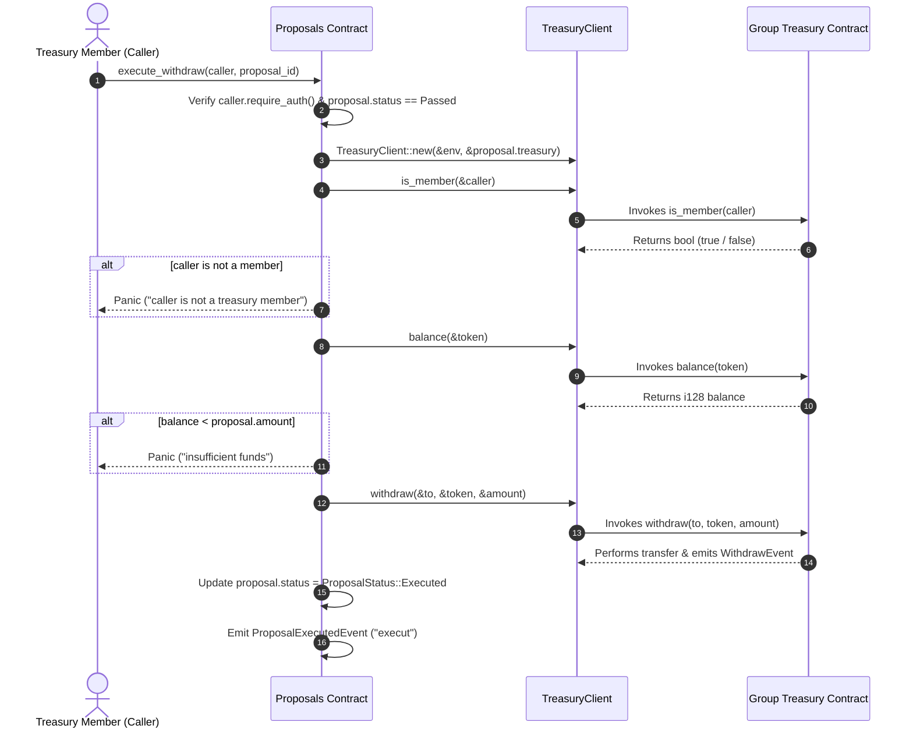

# 📜 Proposals Smart Contract API Reference (`proposals`)

The `proposals` contract manages community-funding proposals, voting, finalization, execution, and cross-contract withdrawals from a `group_treasury` contract on Soroban (Stellar).

- **Contract Location**: [`contracts/contracts/proposals/src/lib.rs`](file:///c:/Users/USER%20PC/vscode-remote-wsl/clicked/contracts/contracts/proposals/src/lib.rs)
- **Storage Definitions**: [`contracts/contracts/proposals/src/storage.rs`](file:///c:/Users/USER%20PC/vscode-remote-wsl/clicked/contracts/contracts/proposals/src/storage.rs)
- **Treasury Interface**: [`contracts/contracts/proposals/src/treasury_interface.rs`](file:///c:/Users/USER%20PC/vscode-remote-wsl/clicked/contracts/contracts/proposals/src/treasury_interface.rs)

---

## 📐 Data Architecture & Storage Keys

### Storage Keys (`DataKey`)
All state data is stored in the contract's instance storage using the `DataKey` enum:

| Key Variant | Value Type | Description |
| :--- | :--- | :--- |
| `DataKey::Admin` | `Address` | Address of the contract administrator |
| `DataKey::NextProposalId` | `u64` | Auto-incrementing counter for proposal IDs |
| `DataKey::Proposal(u64)` | `Proposal` | Struct containing full state of proposal `u64` |
| `DataKey::Vote(u64, Address)` | `bool` | Vote record for `(proposal_id, voter)` (`true` = Yes, `false` = No) |

### Enums & Data Structures

#### `ProposalStatus`
```rust
pub enum ProposalStatus {
    Active,
    Approved,
    Passed,
    Rejected,
    Executed,
    Expired,
}
```

#### `Proposal`
```rust
pub struct Proposal {
    pub id: u64,
    pub proposer: Address,
    pub description: String,
    pub created_at: u64,
    pub expires_at: u64,
    pub yes_votes: u32,
    pub no_votes: u32,
    pub status: ProposalStatus,

    // Withdrawal execution parameters
    pub treasury: Address,
    pub token: Address,
    pub to: Address,
    pub amount: i128,
}
```

---

## 🛠️ Public Functions

### 1. `initialize`
Initializes the contract admin slot and sets the initial proposal ID counter to `0`.

#### Full Signature
```rust
pub fn initialize(env: Env, admin: Address)
```

#### Parameters
- `env: Env`: The Soroban environment context.
- `admin: Address`: The address designated as administrator.

#### Authorization Requirements
- `admin.require_auth()`: Must be signed by `admin`.

#### State Mutations
- Sets `DataKey::Admin` -> `admin`.
- Sets `DataKey::NextProposalId` -> `0u64`.

#### Panics & Error Conditions
- Panics with `"already initialized"` if `DataKey::Admin` already exists in storage.

#### Complexity Design
- **Time Complexity**: $\mathcal{O}(1)$ instance storage check and writes.
- **Space Complexity**: $\mathcal{O}(1)$ fixed storage overhead.

---

### 2. `create_proposal`
Creates a new community funding proposal with specified expiration and treasury withdrawal details.

#### Full Signature
```rust
pub fn create_proposal(
    env: Env,
    proposer: Address,
    description: String,
    expires_at: u64,
    treasury: Address,
    token: Address,
    to: Address,
    amount: i128,
) -> u64
```

#### Parameters
- `env: Env`: The Soroban environment context.
- `proposer: Address`: Address creating the proposal.
- `description: String`: Text description of the proposal.
- `expires_at: u64`: Ledger timestamp (in Unix seconds) when voting closes.
- `treasury: Address`: Target `group_treasury` contract address for funding withdrawal.
- `token: Address`: Stellar asset/token contract address to withdraw.
- `to: Address`: Recipient address for funding.
- `amount: i128`: Amount of tokens requested (must be $> 0$).

#### Return Value
- `u64`: The assigned proposal ID.

#### Authorization Requirements
- `proposer.require_auth()`: Must be signed by `proposer`.

#### State Mutations
- Allocates proposal under `DataKey::Proposal(id)`.
- Increments `DataKey::NextProposalId` by `1`.
- Emits event topic `"proposal_created"` containing `ProposalCreatedEvent`.

#### Panics & Error Conditions
- Panics with `"expires_at must be in the future"` if `expires_at <= env.ledger().timestamp()`.
- Panics with `"amount must be positive"` if `amount <= 0`.

#### Complexity Design
- **Time Complexity**: $\mathcal{O}(1)$ instance storage read/write and event publish.
- **Space Complexity**: $\mathcal{O}(L)$ where $L$ is the byte length of `description`.

---

### 3. `vote`
Casts a single vote (`support: true` for Yes, `false` for No) on an active proposal.

#### Full Signature
```rust
pub fn vote(env: Env, voter: Address, proposal_id: u64, support: bool)
```

#### Parameters
- `env: Env`: The Soroban environment context.
- `voter: Address`: Address casting the vote.
- `proposal_id: u64`: ID of the target proposal.
- `support: bool`: `true` to vote Yes, `false` to vote No.

#### Authorization Requirements
- `voter.require_auth()`: Must be signed by `voter`.

#### State Mutations
- Writes `DataKey::Vote(proposal_id, voter)` -> `support`.
- Increments `yes_votes` (if `support == true`) or `no_votes` (if `support == false`) on `DataKey::Proposal(proposal_id)`.
- Emits event topic `"vote_cast"` containing `VoteCastEvent`.

#### Panics & Error Conditions
- Panics with `"proposal not found"` if `proposal_id` does not exist.
- Panics with `"proposal is not active"` if proposal status is not `ProposalStatus::Active`.
- Panics with `"voting window has closed"` if `env.ledger().timestamp() >= proposal.expires_at`.
- Panics with `"voter has already voted"` if `DataKey::Vote(proposal_id, voter)` exists in instance storage.

#### Complexity Design
- **Time Complexity**: $\mathcal{O}(1)$ instance storage lookups and updates.
- **Space Complexity**: $\mathcal{O}(1)$ per vote record in instance storage.

---

### 4. `finalize_proposal`
Finalizes a proposal after its voting window has expired, updating its status based on vote tally.

#### Full Signature
```rust
pub fn finalize_proposal(env: Env, proposal_id: u64) -> ProposalStatus
```

#### Parameters
- `env: Env`: The Soroban environment context.
- `proposal_id: u64`: ID of the proposal to finalize.

#### Return Value
- `ProposalStatus`: Returns `ProposalStatus::Passed` if `yes_votes > no_votes`, otherwise `ProposalStatus::Rejected`.

#### Authorization Requirements
- None (unauthenticated public function; anyone can trigger finalization after expiry).

#### State Mutations
- Updates `status` of `DataKey::Proposal(proposal_id)` to `Passed` or `Rejected`.
- Emits event topic `"proposal_finalized"` containing `ProposalFinalizedEvent`.

#### Panics & Error Conditions
- Panics with `"proposal not found"` if `proposal_id` does not exist.
- Panics with `"proposal already finalized"` if proposal status is not `ProposalStatus::Active`.
- Panics with `"cannot finalize before expiry"` if `env.ledger().timestamp() < proposal.expires_at`.

#### Complexity Design
- **Time Complexity**: $\mathcal{O}(1)$ state read, evaluation, and update.
- **Space Complexity**: $\mathcal{O}(1)$.

---

### 5. `finalize_expired_proposal`
Explicitly marks an active proposal past its expiration time as `Expired`.

#### Full Signature
```rust
pub fn finalize_expired_proposal(env: Env, proposal_id: u64)
```

#### Parameters
- `env: Env`: The Soroban environment context.
- `proposal_id: u64`: ID of the proposal to mark as expired.

#### Authorization Requirements
- None (unauthenticated public function).

#### State Mutations
- Updates `status` of `DataKey::Proposal(proposal_id)` to `ProposalStatus::Expired`.
- Emits event topic `"proposal_expired"` containing `ProposalExpiredEvent`.

#### Panics & Error Conditions
- Panics with `"proposal not found"` if `proposal_id` does not exist.
- Panics with `"proposal not Pending"` if proposal status is not `ProposalStatus::Active`.
- Panics with `"proposal not expired"` if `env.ledger().timestamp() <= proposal.expires_at`.

#### Complexity Design
- **Time Complexity**: $\mathcal{O}(1)$.
- **Space Complexity**: $\mathcal{O}(1)$.

---

### 6. `execute_proposal`
Executes a simple proposal without treasury withdrawal by marking status as `Executed`.

#### Full Signature
```rust
pub fn execute_proposal(env: Env, executor: Address, proposal_id: u64)
```

#### Parameters
- `env: Env`: The Soroban environment context.
- `executor: Address`: Address triggering execution.
- `proposal_id: u64`: ID of the passed proposal.

#### Authorization Requirements
- `executor.require_auth()`: Must be signed by `executor`.

#### State Mutations
- Updates `status` of `DataKey::Proposal(proposal_id)` to `ProposalStatus::Executed`.
- Emits event topic `executed` containing `ProposalExecutedEvent`.

#### Panics & Error Conditions
- Panics with `"proposal not found"` if `proposal_id` does not exist.
- Panics with `"proposal is not in Passed state"` if proposal status is not `ProposalStatus::Passed`.

#### Complexity Design
- **Time Complexity**: $\mathcal{O}(1)$.
- **Space Complexity**: $\mathcal{O}(1)$.

---

### 7. `execute_withdraw`
Executes a passed community funding proposal by calling into the target `group_treasury` smart contract via a cross-contract client.

#### Full Signature
```rust
pub fn execute_withdraw(env: Env, caller: Address, proposal_id: u64)
```

#### Parameters
- `env: Env`: The Soroban environment context.
- `caller: Address`: Treasury member executing the withdrawal.
- `proposal_id: u64`: ID of the approved/passed proposal.

#### Authorization Requirements
- `caller.require_auth()`: Must be signed by `caller`.

#### State Mutations
- Updates `status` of `DataKey::Proposal(proposal_id)` to `ProposalStatus::Executed`.
- Emits event topic `execut` containing `ProposalExecutedEvent`.

#### Panics & Error Conditions
- Panics with `"proposal not found"` if `proposal_id` does not exist.
- Panics with `"proposal already executed"` if proposal status is `ProposalStatus::Executed`.
- Panics with `"proposal not approved"` if proposal status is not `ProposalStatus::Passed`.
- Panics with `"caller is not a treasury member"` if cross-contract call `is_member(&caller)` returns `false`.
- Panics with `"insufficient funds"` if cross-contract call `balance(&token)` is less than `proposal.amount`.

#### Complexity Design
- **Time Complexity**: $\mathcal{O}(1)$ local CPU instructions + 3 cross-contract WASM invocation overheads (`is_member`, `balance`, `withdraw`).
- **Space Complexity**: $\mathcal{O}(1)$.

---

### 8. `get_proposal`
Read-only accessor function to retrieve full proposal details.

#### Full Signature
```rust
pub fn get_proposal(env: Env, proposal_id: u64) -> Proposal
```

#### Parameters
- `env: Env`: The Soroban environment context.
- `proposal_id: u64`: Target proposal ID.

#### Return Value
- `Proposal`: Complete proposal struct.

#### Authorization Requirements
- None (read-only query).

#### Panics & Error Conditions
- Panics with `"proposal not found"` if `proposal_id` does not exist in storage.

#### Complexity Design
- **Time Complexity**: $\mathcal{O}(1)$ instance storage retrieval.
- **Space Complexity**: $\mathcal{O}(1)$.

---

## 🔗 Cross-Contract Call Architecture: `execute_withdraw` & `group_treasury`

When `execute_withdraw` is invoked, the `proposals` contract interacts directly with the specified `group_treasury` contract using the generated Soroban client `TreasuryClient` defined in [`treasury_interface.rs`](file:///c:/Users/USER%20PC/vscode-remote-wsl/clicked/contracts/contracts/proposals/src/treasury_interface.rs):

```rust
#[contractclient(name = "TreasuryClient")]
pub trait TreasuryInterface {
    fn is_member(env: Env, member: Address) -> bool;
    fn balance(env: Env, token: Address) -> i128;
    fn withdraw(env: Env, to: Address, token: Address, amount: i128);
}
```

### Execution Flow:


---

## 🔄 Worked Lifecycles & Examples

### Scenario 1: Successful Proposal Lifecycle (Create → Vote → Finalize → Execute Withdraw)

1. **Initialization**:
   ```rust
   ProposalsContract::initialize(env, admin_address);
   ```
2. **Creation**:
   `Proposer` creates Proposal #0 with 1-hour expiration (`expires_at = now + 3600`):
   ```rust
   let id = ProposalsContract::create_proposal(
       env,
       proposer_address,
       String::from_str(&env, "Fund Community Meetup"),
       now + 3600,
       treasury_contract_address,
       xlm_token_address,
       recipient_address,
       500_0000000 // 500 XLM
   ); // Returns 0
   ```
3. **Voting Window**:
   Members cast votes before `expires_at`:
   ```rust
   ProposalsContract::vote(env, voter1, 0, true);  // Yes +1
   ProposalsContract::vote(env, voter2, 0, true);  // Yes +2
   ProposalsContract::vote(env, voter3, 0, false); // No +1
   ```
4. **Finalization (Post-Expiry)**:
   After timestamp exceeds `expires_at`:
   ```rust
   let status = ProposalsContract::finalize_proposal(env, 0);
   // yes_votes (2) > no_votes (1) => status = ProposalStatus::Passed
   ```
5. **Withdrawal Execution**:
   A treasury member executes the approved proposal:
   ```rust
   ProposalsContract::execute_withdraw(env, treasury_member, 0);
   // Status updated to ProposalStatus::Executed, funds transferred from treasury.
   ```

---

### Scenario 2: Expired / Rejected Proposal Lifecycle (Create → Vote → Finalize → Rejection / Expiry)

1. **Creation**:
   `Proposer` creates Proposal #1:
   ```rust
   let id = ProposalsContract::create_proposal(
       env, proposer_address, description, now + 1800,
       treasury_address, token_address, to_address, 1000
   ); // Returns 1
   ```
2. **Voting (Rejection Path)**:
   ```rust
   ProposalsContract::vote(env, voter1, 1, false); // No +1
   ProposalsContract::vote(env, voter2, 1, false); // No +2
   ```
3. **Finalization**:
   After `expires_at`:
   ```rust
   let status = ProposalsContract::finalize_proposal(env, 1);
   // yes_votes (0) <= no_votes (2) => status = ProposalStatus::Rejected
   ```
4. **Execution Attempt**:
   Calling `execute_withdraw` or `execute_proposal` on a `Rejected` proposal panics:
   ```rust
   ProposalsContract::execute_withdraw(env, caller, 1);
   // Panic: "proposal not approved"
   ```

5. **Direct Expiry Path (`finalize_expired_proposal`)**:
   If an active proposal expires without being finalized via vote tally:
   ```rust
   ProposalsContract::finalize_expired_proposal(env, 1);
   // Updates status directly to ProposalStatus::Expired
   ```
