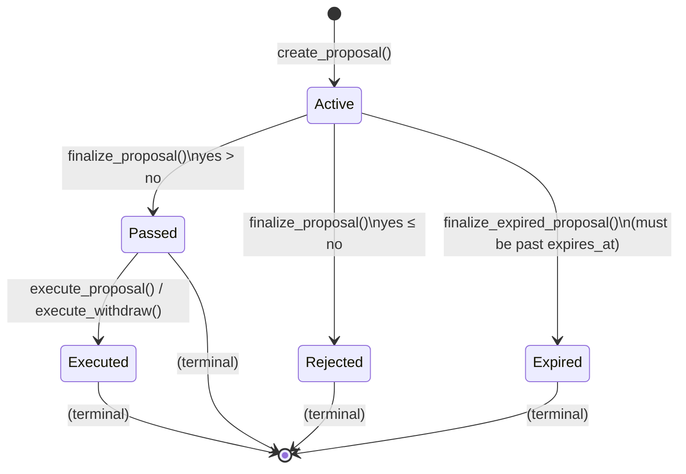

# Proposal Lifecycle & Voting Model

## Overview

The `proposals` contract is an on-chain community-funding mechanism built on
Soroban (Stellar's smart-contract platform). It lets anyone create a funding
proposal that specifies a recipient, token, and amount, lets anyone cast a
yes/no vote during a defined voting window, and — if the vote succeeds —
allows a treasury member to release the funds from the group treasury.

A separate `group_treasury` contract holds the funds and enforces
membership-based access controls. The `proposals` contract calls into the
treasury via the `TreasuryInterface` (`is_member`, `balance`, `withdraw`).

---

## Proposal Status State Machine

Every proposal transitions through the finite state machine below.  The six
`ProposalStatus` variants are defined in `storage.rs`:

| Status     | Meaning |
|------------|---------|
| `Active`   | Voting is open. |
| `Passed`   | Voting has closed and yes-votes outnumbered no-votes. The proposal is ready for execution. |
| `Rejected` | Voting has closed and yes-votes did **not** outnumber no-votes (tie counts as rejection). |
| `Expired`  | Voting has closed and `finalize_expired_proposal` was called instead of `finalize_proposal`. No execution path exists from this state. |
| `Executed` | Funds have been withdrawn (or the MVP execution marker has been set). |
| `Approved` | Defined but **unused** in the current contract. Reserved for future use. |



### Function calls that cause each transition

| Transition | Caller | Condition |
|---|---|---|
| `None → Active` | Anyone | `create_proposal` with `expires_at > now` and `amount > 0` |
| `Active → Passed` | Anyone | `finalize_proposal` called **after** `expires_at`, `yes_votes > no_votes` |
| `Active → Rejected` | Anyone | `finalize_proposal` called **after** `expires_at`, `yes_votes ≤ no_votes` |
| `Active → Expired` | Anyone | `finalize_expired_proposal` called **after** `expires_at` |
| `Passed → Executed` | Anyone (MVP) / Treasury member (real) | `execute_proposal` / `execute_withdraw` |

---

## Proposal Creation

Anyone can call `create_proposal` with the following parameters:

| Parameter     | Type      | Description |
|---------------|-----------|-------------|
| `proposer`    | `Address` | The creator (must authenticate). |
| `description` | `String`  | A human-readable description of the proposal. |
| `expires_at`  | `u64`     | Unix timestamp (seconds) when voting closes. Must be strictly in the future. |
| `treasury`    | `Address` | The group treasury contract that holds the funds. |
| `token`       | `Address` | The token contract to withdraw. |
| `to`          | `Address` | The recipient of the funds. |
| `amount`      | `i128`    | The amount to withdraw. Must be positive. |

On success the contract:

1. Assigns a monotonically-increasing `id` from `NextProposalId`.
2. Stores a `Proposal` struct with `status: Active`, `yes_votes: 0`, `no_votes: 0`.
3. Publishes a `proposal_created` event.

**Guards:**
- `expires_at <= now` → panic ("expires_at must be in the future").
- `amount <= 0` → panic ("amount must be positive").

---

## Voting

### Mechanics

Any address may call `vote(proposer, proposal_id, support)` where `support` is
`true` for yes and `false` for no. Each address may vote **at most once per
proposal** — re-voting panics.

#### Voting Rules (what the code actually enforces)

| Rule | Enforcement |
|---|---|
| **One address, one vote** | Stored as `DataKey::Vote(proposal_id, voter) → bool`. If the key exists, `vote` panics. |
| **No weighted voting** | Each address contributes exactly 1 to `yes_votes` or `no_votes`. There is no token-weighting, quadratic voting, or reputation multiplier. |
| **No quorum** | A proposal can pass with a single yes-vote and zero no-votes. There is no minimum participation floor. |
| **Voting window** | Voting is only permitted while `now < expires_at`. Attempting to vote at or after expiry panics. |
| **Status check** | Voting is only permitted while `status == Active`. A finalized or expired proposal cannot receive votes. |

### Vote storage

Votes are recorded in instance storage under the composite key
`DataKey::Vote(proposal_id, voter)`. The value is a `bool` — `true` for yes,
`false` for no. The aggregate counters `Proposal.yes_votes` and
`Proposal.no_votes` are incremented atomically at vote time.

---

## Finalization

### Normal finalization — `finalize_proposal`

Callable by **anyone** after the proposal's `expires_at` has passed
(`now >= expires_at`). This function:

1. Checks the proposal is still `Active` (panics if already finalized).
2. Checks the proposal is past its expiry (panics if `now < expires_at`).
3. Applies the pass/fail rule and publishes a `proposal_finalized` event.

**Pass / Fail rule (simple plurality):**

```
if yes_votes > no_votes → Passed
else                   → Rejected
```

Key implications:

| Scenario | Votes | Outcome |
|---|---|---|
| More yes than no | yes=3, no=1 | **Passed** |
| Tie | yes=2, no=2 | **Rejected** |
| All no / no votes | yes=0, no=1 | **Rejected** |
| Zero votes total | yes=0, no=0 | **Rejected** |

> There is **no quorum**. A single yes-vote with zero no-votes is enough to
> pass. The threshold is a simple majority of cast votes, not a majority of
> the total eligible voter base.

### Expiry finalization — `finalize_expired_proposal`

This is a **separate function** from `finalize_proposal`. It exists because
the normal finalization always produces either `Passed` or `Rejected` based on
a vote tally, whereas `finalize_expired_proposal` produces a semantically
distinct `Expired` outcome without tallying votes.

#### Why a separate function?

1. **Semantic clarity.** A proposal that reaches expiry with, say, 1 yes and 0
   no votes is functionally "Passed" under the plurality rule. But if the
   contract's operators want a cleaner UX where proposals that nobody bothered
   to vote on are marked as `Expired` (not `Rejected`), they need a path that
   skips the tally. This function provides that path.

2. **Mutual exclusivity.** Once a proposal transitions to `Passed` or
   `Rejected` via `finalize_proposal`, `finalize_expired_proposal` panics
   (and vice versa). The two functions are **exclusive paths** out of the
   `Active` state. This is enforced by the status check at the top of each
   function.

3. **Guard condition difference.** `finalize_proposal` requires
   `now >= expires_at`, while `finalize_expired_proposal` requires
   `now > expires_at` (strict). At the exact expiry second, only normal
   finalization is available.

```
Time | Action
─────┼──────────────────────────────────────────
  t  | expires_at
  t  | finalize_proposal ✓   (now >= expires_at)
  t  | finalize_expired_proposal ✗  (now <= expires_at, strict > required)
  t+1| finalize_expired_proposal ✓
```

#### What happens after expiry

Once a proposal is `Expired`, **no execution is possible**. The `Expired`
status is a terminal state with no outgoing transitions.

---

## Execution (Treasury Withdrawal)

A proposal in the `Passed` state can be executed in two ways:

### 1. `execute_proposal` (MVP / off-chain)

This is the minimal execution path:

```rust
pub fn execute_proposal(env: Env, executor: Address, proposal_id: u64)
```

- Requires `status == Passed`.
- Flips status to `Executed` and emits a `ProposalExecutedEvent`.
- **Does not** interact with the treasury. This is a placeholder for
  off-chain observers to react to the event.

### 2. `execute_withdraw` (on-chain treasury withdrawal)

This is the full execution path that completes the proposal lifecycle by
releasing funds from the `group_treasury`:

```rust
pub fn execute_withdraw(env: Env, caller: Address, proposal_id: u64)
```

**Step-by-step flow:**

1. **Authenticate caller.** `caller.require_auth()`.
2. **Load proposal.** Panics if `status == Executed` ("proposal already
   executed") or if `status != Passed` ("proposal not approved").
3. **Verify treasury membership.** Calls `treasury.is_member(caller)`.
   Panics if the caller is not a member ("caller is not a treasury member").
4. **Check balance.** Calls `treasury.balance(proposal.token)`. Panics if
   the treasury's balance for the token is less than `proposal.amount`.
5. **Withdraw.** Calls `treasury.withdraw(proposal.to, proposal.token,
   proposal.amount)`, which transfers tokens from the treasury to the
   proposal's designated recipient.
6. **Mark executed.** Flips `proposal.status = Executed`.
7. **Emit events.** Publishes both the treasury `WithdrawEvent` (via the
   treasury contract) and a `ProposalExecutedEvent` on the proposals
   contract.

**Guards:**
- `status != Passed` → panic ("proposal not approved").
- `status == Executed` → panic ("proposal already executed").
- Caller is not a treasury member → panic ("caller is not a treasury member").
- Insufficient treasury balance → panic ("insufficient funds").

---

## Event Reference

Every state-changing function publishes a Soroban event:

| Function | Event Key | Payload |
|---|---|---|
| `create_proposal` | `proposal_created` | `ProposalCreatedEvent` |
| `vote` | `vote_cast` | `VoteCastEvent` |
| `finalize_proposal` | `proposal_finalized` | `ProposalFinalizedEvent` |
| `finalize_expired_proposal` | `proposal_expired` | `ProposalExpiredEvent` |
| `execute_proposal` | `executed` | `ProposalExecutedEvent` |
| `execute_withdraw` | `execut` | `ProposalExecutedEvent` |

---

## Connection to `group_treasury`

The `proposals` contract is tightly coupled to the `group_treasury` contract
through the `TreasuryInterface`:

```
ProposalsContract ──TreasuryInterface──▶ GroupTreasuryContract
     │                                          │
     │  is_member(caller) ──────────────────────▶ checks member list
     │  balance(token)   ──────────────────────▶ returns token balance
     │  withdraw(to, token, amount) ───────────▶ admin-authenticated transfer
     ▼
  Executed (funds released)
```

- `is_member` is called to authorize the `execute_withdraw` caller.
- `balance` is called to verify sufficient funds before withdrawal.
- `withdraw` is called to execute the actual token transfer. The treasury's
  `withdraw` function requires admin auth, which is satisfied via
  `env.mock_all_auths_allowing_non_root_auth()` in the test environment and
  the treasury admin's key in production.

### Lifecycle summary

```
  ┌──────────────────────────────────────────────────────────────┐
  │  1. Someone creates a proposal (Active)                      │
  │  2. Anyone votes yes/no until expires_at                     │
  │  3. After expiry:                                            │
  │     ├── finalize_proposal → Passed or Rejected               │
  │     └── finalize_expired_proposal → Expired                  │
  │  4. If Passed:                                               │
  │     └── Treasury member calls execute_withdraw               │
  │         → treasury.withdraw() → status = Executed            │
  └──────────────────────────────────────────────────────────────┘
```
