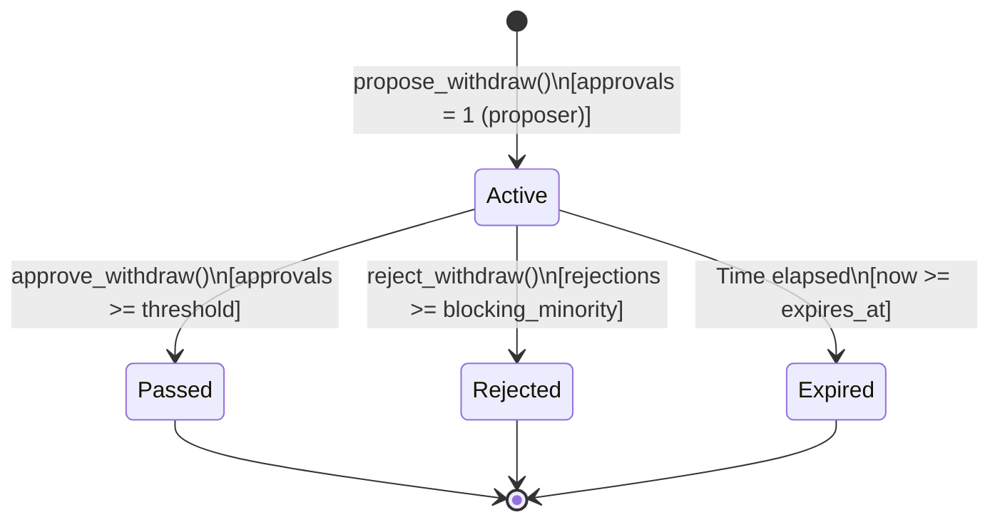
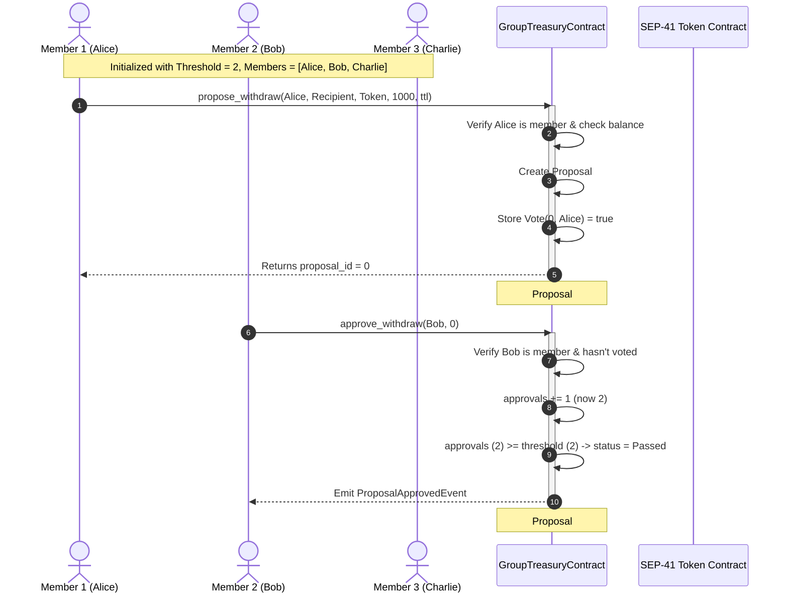

# Group Treasury Multisig & Authorization Model

## Overview

The `group_treasury` contract (`contracts/contracts/group_treasury/`) is a smart contract built on Soroban (Stellar's smart contract platform) that manages shared token holdings for decentralized groups, DAOs, and team organizations.

In a collective treasury, managing custody of funds requires balancing security against operational flexibility. A naive single-signature model—where any registered member or single private key can unilaterally disburse tokens—introduces a critical single point of failure: a single compromised key, rogue actor, or accidental transaction can drain the entire treasury.

To solve this, the `group_treasury` contract implements a **multi-signature approval-threshold model ($M$-of-$N$)**. Under this architecture, spending treasury funds collaboratively requires creating a formal on-chain withdrawal proposal that must accumulate a pre-configured number of affirmative member votes ($M$ approvals out of $N$ eligible members) before the proposal is approved.

```
┌─────────────────────────────────────────────────────────────────────────────┐
│                            Group Treasury Contract                          │
│                                                                             │
│  ┌──────────────────────┐   ┌──────────────────────┐   ┌─────────────────┐  │
│  │      Admin Role      │   │     Members (N)      │   │  Threshold (M)  │  │
│  │ (Init, Add/Del Mbrs) │   │ (Propose & Vote)     │   │ (Pass Criteria) │  │
│  └──────────────────────┘   └──────────────────────┘   └─────────────────┘  │
│                                                                             │
│                               Withdrawal Flow                               │
│  [Member] ──propose_withdraw()──► [Active Proposal]                         │
│                                          │                                  │
│                 ┌────────────────────────┴────────────────────────┐         │
│                 ▼                                                 ▼         │
│         approve_withdraw()                                reject_withdraw() │
│        (approvals >= M ?)                           (rejections >= N-M+1 ?) │
│                 │                                                 │         │
│                 ▼                                                 ▼         │
│         [Passed Proposal]                                [Rejected Proposal]│
└─────────────────────────────────────────────────────────────────────────────┘
```

---

## System Roles & Authorization Architecture

The contract distinguishes between three tiers of access:

| Role | Entity / Condition | Key Capabilities | Authorization Check |
| :--- | :--- | :--- | :--- |
| **Administrator** | Address stored under `DataKey::Admin` | Initialise contract, add/remove members, direct administrative withdrawal | `require_admin()` → `admin.require_auth()` |
| **Treasury Member** | Address present in `DataKey::Members` list | Submit withdrawal proposals, cast approval or rejection votes | `require_votable()` / `is_member()` + `voter.require_auth()` |
| **Public / Any Caller** | Any valid Stellar address | Deposit tokens into treasury, query balances, fetch proposal status and member rosters | None (deposits require `from.require_auth()`) |

### Administrative Functions vs. Multisig Governance

The `group_treasury` contract includes two distinct operational pathways:

1. **The Direct Admin Path (`withdraw`)**: The designated administrator has the authority to execute direct token withdrawals without proposal consensus. This acts as an administrative escape hatch or integration point for higher-level governing contracts (such as a full DAO contract).
2. **The Decentralized Member Path (`propose_withdraw` / `approve_withdraw` / `reject_withdraw`)**: Designed for peer group governance where funds are spent only through collaborative proposal submission and threshold voting.

---

## Membership Management

Membership in the treasury determines who is eligible to propose withdrawals and cast votes. The membership roster is stored as a vector of addresses (`Vec<Address>`) under `DataKey::Members` in instance storage.

### Adding Members (`add_member`)

- **Authorization**: Callable only by the designated `Admin`.
- **Validation**:
  - Requires admin signature (`admin.require_auth()`).
  - Scans `DataKey::Members` to ensure the address is not already present. If the address already exists, the contract panics with `"member already exists"`.
- **State Change**: Appends the new address to the `Members` vector and persists it back to instance storage.
- **Event**: Emits `MemberAddedEvent { member, added_by }` on the topic `("member_added",)`.

### Removing Members (`remove_member`)

- **Authorization**: Callable only by the designated `Admin`.
- **Validation**:
  - Requires admin signature (`admin.require_auth()`).
  - Scans `DataKey::Members` for the target address. If the target address is not found, the contract panics with `"member not found"`.
- **State Change**: Constructs a new vector excluding the removed member and saves it to instance storage.
- **Event**: Emits `MemberRemovedEvent { member, removed_by }` on the topic `("member_removed",)`.

### Membership Invariants & Queries

- **`is_member(env, member) -> bool`**: Returns `true` if `member` is present in the `Members` vector, `false` otherwise.
- **`get_members(env) -> Vec<Address>`**: Returns the full list of currently registered member addresses.
- **Admin Independence**: The `Admin` is not automatically a member unless explicitly registered via `add_member`.

---

## The Threshold Approval Model ($M$-of-$N$)

### What "Threshold" Means

The **threshold** ($M$) is an integer (`u32`) defining the exact minimum number of affirmative approvals required for a withdraw proposal to transition from `Active` (pending) to `Passed` (approved).

For example:
- In a **2-of-3** treasury: $N = 3$ members, $\text{Threshold} = 2$. Any 2 distinct members must approve a proposal for it to pass.
- In a **3-of-5** treasury: $N = 5$ members, $\text{Threshold} = 3$. At least 3 distinct members must approve.
- In a **1-of-N** treasury: $N \ge 1$, $\text{Threshold} = 1$. The proposer's automatic approval immediately satisfies the threshold.

### How the Threshold is Set

The approval threshold is defined during contract initialization via:

```rust
pub fn initialize(env: Env, admin: Address, _token: Address, threshold: u32)
```

- **Constraint**: `threshold` must be strictly positive ($T \ge 1$). Passing `threshold = 0` causes an immediate panic: `"threshold must be at least 1"`.
- **Storage**: The value is saved under `DataKey::Threshold` in instance storage.
- **Query**: Anyone can read the current threshold using `get_threshold(env) -> u32`.

### Threshold Immutability

In the current contract implementation, the threshold is **immutable** once set at initialization. There is no `set_threshold` or `update_threshold` function. If the group size changes significantly (e.g. from 3 members to 20 members), adjusting the threshold requires deploying a new contract instance or executing a contract upgrade.

---

## Withdrawal Proposal Lifecycle

Every withdraw proposal is tracked by an incrementing numeric identifier (`u32`) and moves through a deterministic state machine.



### 1. Proposal Creation (`propose_withdraw`)

Any active treasury member can initiate a proposal to withdraw a specific amount of tokens to a recipient address.

```rust
pub fn propose_withdraw(
    env: Env,
    proposer: Address,
    to: Address,
    token: Address,
    amount: i128,
    ttl_ledgers: u32,
) -> u32
```

#### Execution & Validation Steps:
1. **Authentication**: `proposer.require_auth()` validates that the caller owns the proposer address.
2. **Membership Check**: `is_member(proposer)` verifies that the proposer is in `DataKey::Members`. If not, panics with `"proposer is not a member"`.
3. **Amount Check**: `amount > 0` verifies the requested withdrawal is positive (`"amount must be positive"`).
4. **Solvency Check**: Checks that the treasury's current balance for `token` is at least `amount` (`balances.get(token) >= amount`). Panics with `"insufficient funds"` if balance is insufficient.
5. **ID Allocation**: Reads `DataKey::ProposalCount` (defaulting to `0`), increments the counter by 1, and assigns the previous value as the proposal `id`.
6. **Expiry Calculation**:
   $$\text{expires\_at} = \text{env.ledger().timestamp()} + (\text{ttl\_ledgers} \times 5)$$
   *(Assumes ~5 seconds per Stellar ledger block).*
7. **Proposer Auto-Approval**:
   - Initializes `WithdrawProposal` with `approvals: 1`, `rejections: 0`, and `status: ProposalStatus::Active`.
   - Records the proposer's approval vote in storage: `DataKey::Vote(id, proposer) = true`.
8. **Event Emission**: Publishes `ProposalCreatedEvent { id, proposer, to, token, amount, expires_at }` on topic `("proposal_created",)`.

---

### 2. Approval Voting (`approve_withdraw`)

Members other than the proposer review the proposal and cast affirmative votes.

```rust
pub fn approve_withdraw(env: Env, approver: Address, proposal_id: u32)
```

#### Verification & Voting Rules:
1. **`require_votable` Validation**:
   - `approver.require_auth()` ensures signature validity.
   - `is_member(approver)` confirms membership (`"not a member"`).
   - Proposal must exist (`"proposal not found"`).
   - Proposal must be active (`status == ProposalStatus::Active`).
   - Proposal must not be expired (`now < expires_at`).
   - Member must not have previously voted on this proposal (`!has(DataKey::Vote(proposal_id, approver))`). Duplicate votes panic with `"already voted"`.
2. **Vote Record**: Sets `DataKey::Vote(proposal_id, approver) = true`.
3. **Approval Counter**: Increments `proposal.approvals += 1`.
4. **Threshold Check**:
   - If `proposal.approvals >= threshold`, the proposal transitions to `ProposalStatus::Passed`.
   - Publishes `ProposalApprovedEvent { id, approvals, threshold }` on topic `("proposal_approved",)`.
5. **Vote Event**: Emits `WithdrawVoteCastEvent { id, voter: approver, approve: true }` on topic `("withdraw_vote",)`.

---

### 3. Rejection Voting & Early Termination (`reject_withdraw`)

Members who oppose a proposal can cast a rejection vote. To prevent dead proposals from lingering until expiration, the contract implements an **early rejection short-circuit** using a mathematical blocking minority.

```rust
pub fn reject_withdraw(env: Env, rejecter: Address, proposal_id: u32)
```

#### The Blocking Minority Formula:

$$\text{blocking\_minority} = \text{member\_count}.\text{saturating\_sub}(\text{threshold}) + 1$$

- **Mathematical Rationale**: In a group of $N$ total members requiring $T$ approvals:
  - The maximum number of rejections a proposal can tolerate while still being able to pass is $N - T$.
  - Once rejections reach $(N - T + 1)$, there are fewer than $T$ remaining undecided members in the group.
  - At that exact point, it becomes mathematically impossible for the proposal to ever reach $T$ approvals, even if every single remaining member votes yes.

#### Example Calculations:

| Total Members ($N$) | Threshold ($T$) | Max Tolerable Rejections ($N - T$) | Blocking Minority ($N - T + 1$) |
| :---: | :---: | :---: | :---: |
| 3 | 2 | $3 - 2 = 1$ | **2** |
| 5 | 3 | $5 - 3 = 2$ | **3** |
| 5 | 4 | $5 - 4 = 1$ | **2** |
| 10 | 7 | $10 - 7 = 3$ | **4** |

#### Execution Flow:
1. **`require_votable` Validation**: Authenticates rejecter, checks active status, verifies non-expiration, and confirms no prior vote.
2. **Vote Record**: Sets `DataKey::Vote(proposal_id, rejecter) = false`.
3. **Rejection Counter**: Increments `proposal.rejections += 1`.
4. **Blocking Minority Check**:
   - If `proposal.rejections >= blocking_minority`, the proposal status transitions to `ProposalStatus::Rejected`.
   - Emits `ProposalRejectedEvent { id, rejections }` on topic `("proposal_rejected",)`.
5. **Vote Event**: Emits `WithdrawVoteCastEvent { id, voter: rejecter, approve: false }` on topic `("withdraw_vote",)`.

---

## End-to-End Proposal Execution Flow

The sequence diagram below traces the full lifecycle of a multi-signature proposal in a 2-of-3 treasury:



---

## Security Guarantees

The multi-signature authorization architecture achieves the following critical security guarantees:

1. **Collusion & Rogue Actor Resistance**: No single member can misappropriate funds. At least $M$ separate member private keys must be compromised before an unauthorized withdrawal proposal can pass.
2. **Strict Identity & Authentication**: Every state-modifying action requires explicit cryptographic authentication (`require_auth()`). Spoofing proposals or votes from another address is rejected at the Soroban host layer.
3. **Vote Deduplication & Integrity**: Storage keys `DataKey::Vote(proposal_id, voter)` prevent double-voting. A voter cannot vote twice, nor can they vote to approve and subsequently vote to reject.
4. **Solvency Assertion at Proposal Time**: `propose_withdraw` checks that the treasury holds adequate token reserves prior to creating the proposal, rejecting frivolous proposals for non-existent funds.
5. **Time-Bounded Validity (TTL)**: Proposals specify a finite lifetime (`expires_at`). Stale or forgotten proposals cannot be revived after market conditions or governance context have shifted.
6. **Full Event Audit Trail**: Every critical action publishes structured, typed Soroban events (`member_added`, `member_removed`, `proposal_created`, `withdraw_vote`, `proposal_approved`, `proposal_rejected`, `deposit`, `withdraw`), providing full transparency for off-chain indexers and user interfaces.

---

## Known Limitations & Operational Edge Cases

Understanding the limitations and operational nuances of the model is vital for protocol integrators and frontend developers:

### 1. In-Flight Proposals During Membership Changes
- **Vote Preservation**: If a member casts an approval or rejection on an active proposal and is subsequently removed by the admin via `remove_member`, their vote remains recorded in `proposal.approvals` / `proposal.rejections`. The contract does not retroactively deduct votes from removed members.
- **Dynamic Blocking Minority Shift**: Because `reject_withdraw` calculates the blocking minority using `Self::get_members(env).len()` at vote time, removing members reduces $N$, which lowers the blocking minority threshold for pending proposals.
- **Underflow Edge Case**: If the admin removes members such that the total remaining members $N < \text{Threshold}$, then `member_count.saturating_sub(threshold)` evaluates to `0`, resulting in $\text{blocking\_minority} = 1$. In this state, a single rejection will immediately reject any active proposal.

### 2. Immutable Threshold
- The approval threshold $M$ cannot be changed after `initialize()`. If a treasury expands from 3 members to 50 members, the threshold remains fixed at the initial value unless a new contract is deployed.

### 3. Balance Race Conditions
- The solvency check (`balance >= amount`) occurs when `propose_withdraw` is called. If other withdrawals occur in the interim before the proposal passes, the treasury balance could drop below the proposal amount.

### 4. Direct Admin Withdrawal Path
- Because the contract retains an admin-level `withdraw()` entrypoint, overall treasury security is bounded by the security of the `Admin` address. For complete decentralization, the `Admin` address should be set to a DAO governance contract or multisig contract rather than an externally owned account (EOA).

### 5. Proposal Expiry Settlement
- Proposals past their `expires_at` timestamp cannot receive new votes (panicking with `"proposal expired"`). However, their status field in storage remains `ProposalStatus::Active` unless finalized by an external contract or execution mechanism.

---

## Storage Layout Reference

| Storage Key | Storage Scope | Type | Description |
| :--- | :--- | :--- | :--- |
| `DataKey::Admin` | Instance | `Address` | Address of the contract administrator |
| `DataKey::Balances` | Instance | `Map<Address, i128>` | Mapping of token contract address to deposited balance |
| `DataKey::Members` | Instance | `Vec<Address>` | Roster of active member addresses |
| `DataKey::Threshold` | Instance | `u32` | Number of approvals required to pass a proposal |
| `DataKey::ProposalCount` | Instance | `u32` | Total proposals created (also the next proposal ID) |
| `DataKey::Proposal(u32)` | Instance | `WithdrawProposal` | Stored proposal state by proposal ID |
| `DataKey::Vote(u32, Address)`| Instance | `bool` | Vote cast for `(proposal_id, voter)` (`true` = approve, `false` = reject) |

---

## Cross-References

For full function signatures, argument types, return values, and contract errors, refer to the related documentation:

- **[Group Treasury API Reference](api-group-treasury.md)**: Exhaustive API documentation covering every public entry point in `group_treasury`.
- **[Proposal Lifecycle & Voting Model](concepts-proposal-lifecycle.md)**: Conceptual guide for the standalone `proposals` funding contract.
- **[Token Transfer Storage & Interface](contracts-token-transfer-storage.md)**: Storage specifications and SEP-41 token interactions.
